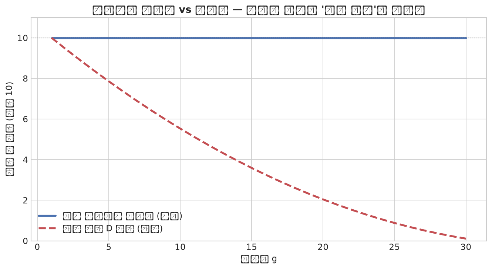
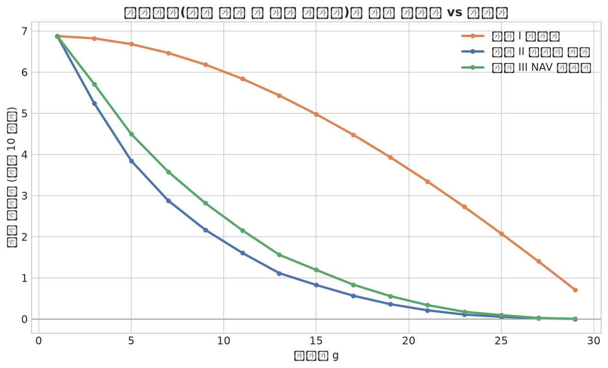
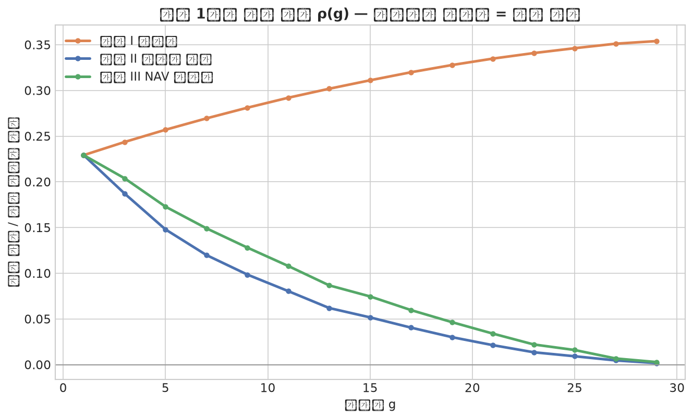
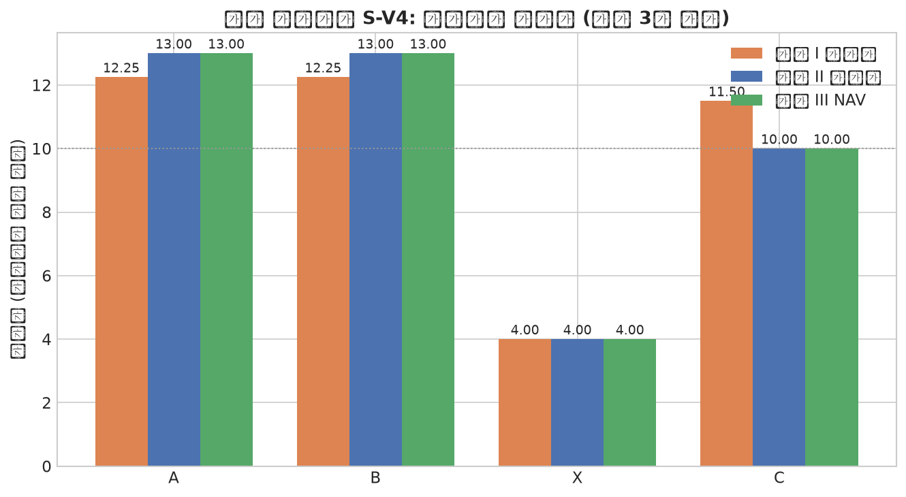
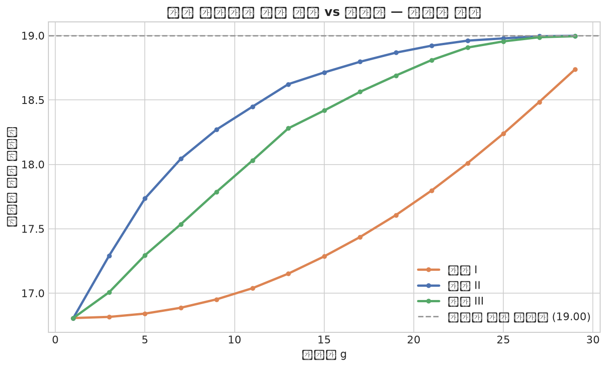

# ver4 중도 참여 설계 — 타이밍 게임과 세 가지 메커니즘

> **갓생 내기 DeFi 프로토콜 — 정산 메커니즘 설계 노트 v2의 속편**
> 작성: 2026-07-18 / 독자: 공대 학부생 / CURVE_DESIGN.md의 표기·명제 번호를 이어씀 (명제 5~8)
> 동봉물: `godsaeng_sim_v4.py` · `figures/v4_1~5.png` · 실행 결과는 스크립트 직접 실행
> 상태: **진모 부재 중 Claude 단독 작성 — 전체가 제안이며 팀 확정 전**

---

## 0. 요약

중도 참여(mid-join)를 열면 세 개의 문제가 발생한다: **회계**(진입 이전 배당의 배제 — 풀린 문제), **커브 시계**(중도참여자의 기간 정의 — 본 문서 명제 5로 종결), **타이밍 게임**(늦게 들어올수록 유리해지는 차익 — 본 문서의 본게임). 타이밍 게임에 대해 세 가지 설계를 구축하고 비교했다:

| | 설계 I — 개방형 (+마감선 τ) | 설계 II — 빈티지 분리 | 설계 III — NAV 진입가 |
|---|---|---|---|
| 합류자의 기존 스트림 접근 | 전면 허용 | **차단** (합류 후 탄생분만) | 허용하되 **공정가 지불** |
| 찍먹 차익 ρ(g) | **우상향 — 스나이핑 존재** | 우하향 — 원천 차단 | 우하향 — 대부분 차단 (정적 가격의 과소책정 잔존) |
| 기존 참가자 희석 | 있음 | 최소 | 프리미엄으로 보상 |
| 구현 비용 | 최소 (acc_per_share 표준) | 중간 (epoch 회계) | 중간 (가격식 1개 추가) |
| 어울리는 방 | **비공개(지인) 방** | 공개방 정공법 | 공개방 이론적 최선 (로드맵) |

**권고**: MVP(스트레치)는 설계 I + 마감선 파라미터. II·III는 설계 분석으로 발표에 포함하고 ver5 config(`join_mode`)의 로드맵으로. 근거는 §8.

---

## 1. 왜 중도 참여이고, 무엇이 어려운가

### 1-1. 동기 두 가지 (진모의 원안)

**콜드 스타트**: 챌린지 방이 "모집 마감 후 시작"이면 방마다 임계 인원을 못 넘겨 죽는 방이 속출한다. 방이 항상 열려 있어야 유동성이 돈다 — AMM이 오더북 대비 갖는 장점과 같은 논리다. **소셜 현실**: 지인 챌린지의 실제 패턴이 그렇다. 4명이 다이어트를 시작하면 2주 뒤에 2명이 "나도 껴줘"라고 온다. 이 흐름을 못 받으면 제품이 현실과 어긋난다.

둘 다 타당하다. 문제는 중도 참여가 **돈의 형평성**과 충돌하는 세 지점이 있다는 것이고, 이 문서는 그 셋을 분리해서 각각 처리한다.

### 1-2. 문제의 분해

**(P-회계)** 합류자가 자기 합류 *이전에 이미 분배된* 배당을 받으면 안 된다. → DeFi 표준 패턴(acc_per_share)으로 풀린 문제. §4에서 설명하되, 이 패턴이 **못 푸는 것**이 무엇인지가 중요하다.

**(P-시계)** 합류자의 몰수 커브에 들어가는 "전체 기간 D"는 무엇인가 — 원래 기간인가, 개인 잔여 기간인가. → §3의 명제 5가 공리로부터 답을 강제한다.

**(P-타이밍)** 합류 시점 자체가 전략 변수가 된다. 늦게 들어오는 것이 유리하다면 아무도 일찍 들어오지 않는다. → §5~6의 본게임.

표기 확장: 참가자 $j$의 합류일 $g_j$ (기존 참가자는 $g_j = 1$), 개인 기간 $D_j = D - g_j + 1$, 글로벌 day $t$에서의 개인 경과일 $d_j(t) = t - g_j + 1$. day 처리 순서는 **① 합류 → ② 탈락 판정(스트림 탄생) → ③ 방출·분배**로 고정한다 — 따라서 day $g$ 합류자에게 day $g$에 태어난 스트림은 "신규"다 (이 순서 규약이 §6의 설계들을 무모호하게 만든다).

---

## 2. 명제 5: 커브 시계는 개인 잔여 기간으로 정규화될 수밖에 없다

(P-시계)는 고민거리처럼 보이지만, CURVE_DESIGN §1의 공리가 답을 이미 결정해 놓았다.

> **명제 5 (기부 함정).** 몰수 커브를 원래 기간 $D$ 기준으로 적용하면 — 즉 합류자의 환급률을 $r(d_j/D)$로 계산하면 — 경계 공리 "완주 시 전액 보전($r=1$)"이 모든 중도참여자에 대해 위반된다. 구체적으로 day $g$ 합류자는 완주해도
> $$r\!\left(\frac{D-g+1}{D}\right) < 1$$
> 만을 환급받으며, 손실분 $s\,[1 - r(\cdot)]$는 성실 완주에 대한 **구조적 벌금**이 된다. 따라서 커브는 개인 타임라인 $r(d_j / D_j)$로 정규화되어야 한다.
>
> **증명.** 합류자의 최대 개인 경과일은 $D_j = D - g + 1 < D$이므로 인자 $D_j/D < 1$이고, $r$은 순증가에 $r(1)=1$이므로 $r(D_j/D) < 1$. 즉 어떤 행동으로도 전액 보전에 도달할 수 없다 — 개인 합리성(IR)이 완주자에 대해 깨진다. IR을 복원하는 유일한 재정규화는 완주 시 인자가 1이 되게 하는 것, 즉 분모를 $D_j$로 두는 것이다. $\blacksquare$

수치로: $D=30$, $\alpha=0.3$에서 day 15 합류자가 원기간 커브 아래 완주하면 환급률 $r(16/30) \approx 0.36$ — **성실하게 다 해내고도 64%를 잃는다.** 커밋먼트 장치가 아니라 함정이다. 아래 그림의 빨간 점선이 그 붕괴를, 파란 실선(정규화)이 복원을 보여준다.

부수 효과 하나를 기록해 둔다: 정규화하면 합류자의 일일 생존 임금(환급 성분)은 $w_r \propto s/D_j$ 스케일이라 **기존 참가자보다 가파르다** — 짧은 계약일수록 하루의 무게가 크다는, 직관과 맞는 성질이다. 문제없음.

---

## 3. 회계 기술: acc_per_share가 푸는 것과 못 푸는 것

(P-회계)의 표준 해법을 먼저 정확히 이해해야 §6의 설계 차이가 보인다.

**패턴 (Aave/MasterChef 계열).** 전역 누적 지수 $\text{acc}(t)$를 유지한다: 매일 배당 발생 시 $\text{acc} \mathrel{+}= \text{방출액} \times \text{SCALE} / S(t)$ ($S(t)$ = 그날 생존 stake 총합). 참가자 $j$는 합류 시점의 지수를 스냅샷($\text{debt}_j = \text{acc}(g_j)$)으로 저장하고, 정산 시

$$\text{배당}_j = s_j \times \big[\text{acc}(\text{탈락 또는 종료 시점}) - \text{acc}(g_j)\big] / \text{SCALE}$$

를 받는다. 합류 이전에 오른 지수는 debt로 차감되므로 **과거에 이미 분배된 몫의 배제가 수학적으로 자동 보장**된다. 순회 없음, $O(1)$, ver3의 `daily_drip`이 "방출액" 자리에 그대로 꽂힌다 — 스트리밍 채택이 ver4 회계를 공짜로 만든 지점이다.

**그러나 — 이 패턴이 배제하는 것은 "과거의 분배"이지 "과거에 태어난 스트림의 미래 방출"이 아니다.** day 3에 태어난 스트림은 day 15 합류자가 들어온 *뒤에도* 계속 방출되고, acc_per_share는 그 미래 방출을 합류자에게 정상적으로 나눠준다. 여기가 (P-회계)와 (P-타이밍)의 경계선이다: 회계는 맞는데, 그 "맞는 회계"가 전략적으로 악용 가능한 것이다.

---

## 4. 타이밍 게임의 정식화

### 4-1. 스나이퍼와 두 개의 지표

최악의 침입자를 정의하자: **스나이퍼** — 체크인에 절대 실패하지 않는(봇이거나, 며칠쯤은 누구나 버티므로 사실상 모든 후반 입장자) 합류자. 스나이퍼가 day $g$에 입장할 때의:

$$\Pi(g) = \mathbb{E}[\text{수령 총액}] - s \quad \text{(절대 차익)}, \qquad \rho(g) = \frac{\Pi(g)}{D - g + 1} \quad \text{(노력 1일당 차익)}$$

$\rho$가 진짜 지표인 이유: 스나이퍼의 비용은 돈이 아니라 **체크인 일수**다. 게다가 체류가 짧을수록 실패 위험이 기하급수로 준다 — day 29 입장자의 "2일 버티기"는 사실상 무위험이다. 즉 $\rho$는 노력 보정임과 동시에 위험 보정의 1차 근사다. 설계 목표는 자명하다: **$\rho(g)$가 $g$에 대해 증가하면 안 된다.** 증가하면 "짧게 들어와 국물만 떠먹는" 전략 — 이하 찍먹 — 이 우월해지고, 모두가 그 논리를 알면 이른 입장이 사라지는 **역행 붕괴(unraveling)**로 이어진다: 방은 열려 있는데 아무도 먼저 안 들어오는, 콜드 스타트를 풀려다 콜드 스타트를 재생산하는 자기모순.

### 4-2. 개방형에서 찍먹 가치의 원천 — 닫힌 형태

> **명제 6.** 개방형(설계 I) 하에서, day $g$ 입장자가 접근하는 **기존 스트림의 미방출 잔량**은
> $$R(g) = \Delta(g^-) \cdot (D - g + 1)$$
> 이고 ($\Delta(g^-)$ = day $g$ 직전의 전역 drip), 추가 탈락이 없는 결정론적 경로에서 스나이퍼의 기존-스트림 포획액은
> $$\text{capture}(g) = R(g)\cdot\frac{s}{S + s}$$
> 이다.
>
> **증명.** 모든 스트림의 종점이 $D$이므로 잔여 방출은 (현재 방출률) × (잔여 일수) = $\Delta(g^-)(D-g+1)$. 이를 매일 지분 $s/(S+s)$로 수령하면 합산이 위 식. $\blacksquare$

이 식이 찍먹의 해부도다: $\Delta$는 단조증가(명제 3a)라 늦게 갈수록 커지고, 잔여 일수는 줄어든다 — 두 힘의 곱이라 절대액 $\Pi$의 형태는 자명하지 않다. 그래서 몬테카를로를 돌렸고, 결과가 교훈적이다.

### 4-3. MC 결과: 절대액은 조기 우세, 일당 수익률은 개방형만 우상향

설정: 기존 8인(각 10, 좌편향 위험률 $h(d)=0.06\times0.92^{d-1}$) + 스나이퍼 1인, $D=30$, $\alpha=0.3$, 600회 × 공통 난수(같은 탈락 시나리오를 전 설계·전 $g$에 재사용 — 분산 축소).

| | $\Pi(1)$ | $\Pi(15)$ | $\Pi(29)$ | $\rho(1)$ | $\rho(15)$ | $\rho(29)$ | $\rho$ 최대 위치 |
|---|---|---|---|---|---|---|---|
| I 개방형 | 6.88 | 4.98 | 0.71 | 0.229 | 0.311 | **0.354** | **$g=29$ (우상향)** |
| II 빈티지 | 6.88 | 0.83 | 0.00 | 0.229 | 0.052 | 0.002 | $g=1$ (우하향) |
| III NAV | 6.88 | 1.19 | 0.01 | 0.229 | 0.075 | 0.003 | $g=1$ (우하향) |

읽는 법. **절대액 $\Pi$는 세 설계 모두 조기 입장이 우세하다** — 일찍 들어와야 게임 전체의 몰수 질량을 나눠 받으니 당연하고, 이건 건강한 성질이다 (돈만 보면 일찍 들어올 이유가 있다). 문제는 **$\rho$**다: 개방형만 우상향한다. 뜻을 풀면 — day 29에 들어온 스나이퍼는 **이틀 체크인하고 0.71을 가져간다** (예치 10 대비 7%, 사실상 무위험·무노력). 반면 빈티지 분리에서 같은 행동의 수확은 0.003, 사실상 0이다. 개방형의 찍먹은 실재하고, 빈티지 분리는 그것을 원천 절단한다.

한 가지 정직한 관찰: 찍먹 차익은 **자기제한적**이긴 하다 — 스나이퍼가 여럿 몰리면 서로를 희석해 차익이 소산된다(혼잡 균형). 그러나 차익이 0으로 수렴하는 과정에서 방은 후반 관광객으로 채워지고, "같이 갓생 살자"는 커뮤니티는 이미 죽어 있다. EV가 소산되어도 UX 피해는 남는다 — 경제학적 자기제한이 제품 방어가 되지 못하는 이유다.

---

## 5. 세 가지 설계

### 5-1. 설계 I — 개방형 (+ 참여 마감선 τ)

acc_per_share를 그대로 쓴다. 합류자는 debt 스냅샷 이후의 모든 방출 — 기존 스트림 포함 — 을 지분대로 받는다. 유일한 방어 장치는 생성 파라미터 `join_deadline` ($\tau$): 예컨대 기간 50% 경과 후 입장 차단. 찍먹 곡선의 오른쪽 극단을 잘라낼 뿐 구간 내 차익은 남지만, 구현이 공짜이고 규칙이 한 문장이다. 그리고 결정적으로 — **비공개(지인) 방에서는 스나이퍼가 존재하지 않는다.** 친구는 차익거래를 하러 오지 않는다. 문제의 전제(전략적 익명 입장자)가 성립하지 않는 환경에서는 이 설계가 이미 최적이다.

### 5-2. 설계 II — 빈티지 분리

**규칙**: day $b$에 태어난 스트림의 수령 자격 = "day $b$ 이전(포함) 합류자 중 그날 생존자". 합류자는 자기 합류 이후 탄생분만 받는다.

> **명제 7.** 빈티지 분리 하에서 기존 스트림 접근 가치는 항등적으로 0이므로, 찍먹의 원천(명제 6의 $R(g)$ 포획)이 제거된다. 남는 유인은 합류 이후 신규 탈락의 몫뿐이며, 위험률이 좌편향일수록 후반 신규 탈락 질량은 작으므로 $\rho(g)$는 감소한다. (MC: 0.229 → 0.002)

**구현**: 전역 acc 하나로는 안 된다 — 스트림마다 자격 집합이 다르기 때문이다. 정확한 패턴은 **epoch 회계**: 합류 이벤트가 epoch를 가른다. epoch $e$에 태어난 스트림들의 방출은 "epoch $e$ 이전 합류자"에게만 흐르므로, epoch별 누적 지수 $\text{acc}_e$를 유지하고 참가자는 자기 epoch 이하의 지수들만 합산한다. epoch 수 ≤ 합류 이벤트 수 ≤ 참가자 수이므로 프로토 규모(≤5인)에서는 사실상 공짜, 일반 규모에서도 $O(\#\text{epoch})$/일이다. (Uniswap V3의 fee-growth-outside가 같은 사상의 친척이다.)

**대가**: 규칙 설명이 한 문장을 넘는다 — "너는 네가 들어온 뒤에 떨어진 사람 몫만 받아". 사실 이 문장 자체는 직관적이고 오히려 공정하게 들린다는 게 이 설계의 숨은 장점이다.

### 5-3. 설계 III — NAV 진입가 (펀드 기준가 방식)

금융공학의 정석적 해법을 이식한다. 개방형 펀드가 중도 설정(subscription)을 처리하는 방식: 신규 자금은 **현재 순자산가치(NAV)로 지분을 산다** — 펀드에 쌓인 미실현 이익을 공짜로 나눠 받지 못하도록, 그 가치가 매입가에 반영된다. 우리의 "쌓인 미실현 이익" = 기존 스트림의 미방출 잔량 $R(g)$이므로, 합류자가 지불할 공정 프리미엄은 자신의 기대 포획액(명제 6):

$$\boxed{\;p(g) = \Delta(g^-)\,(D-g+1)\cdot\frac{s}{S + s}\;}$$

프리미엄은 예치금과 별도로 지불되어 **기존 생존자에게 지분 비례 즉시 지급**된다 (희석의 사전 보상). 이후 합류자는 개방형과 동일하게 전면 참여한다.

> **명제 8.** 추가 탈락이 없는 결정론적 경로에서, 설계 III의 기존 참가자 수령액은 설계 II와 정확히 일치하고, 합류자의 순손익은 0이다 — III는 "II의 기대값 등가물"이며, 차이는 확률 노출뿐이다 (III의 합류자는 기존 스트림의 미래 변동에 노출을 사고, II의 합류자는 사지 않는다).
>
> **증명.** 결정론 경로에서 합류자의 기존-스트림 포획액은 명제 6에 의해 정확히 $p(g)$ — 프리미엄과 상쇄된다. 기존 생존자는 포획으로 잃은 것을 프리미엄으로 돌려받으므로 II와 동일. 시뮬 검증: S-V4 시나리오에서 III의 A·B = 13.00 = II의 A·B, 합류자 C 순손익 0. $\blacksquare$

**정직한 한계 — 정적 가격의 과소책정.** MC에서 III의 잔존 차익(g=15에서 0.075/일)이 II(0.052)보다 큰 이유: $p(g)$는 지분 $s/(S+s)$를 **입장 시점의 $S$로 고정**해 계산하는데, 실제로는 이후 탈락으로 $S(t)$가 줄어 생존 스나이퍼의 실현 지분이 가격에 반영된 지분보다 커진다. 감소하는 $S$ 경로의 기대값으로 가격을 매기는 **동적 NAV**가 이론적 완결이지만, 생존 경로 추정이 필요해 온체인 비용이 커진다 — 로드맵으로 표기한다. (금융에서 정확히 대응되는 현상이 있다: 희석 방지 조항 없는 펀드의 성과보수 이연 문제.)

---

## 6. 검증 시나리오 S-V4 — 스펙 테스트용 기대값

세 설계를 한 시나리오로 가른다. **D=5, α=1.0. A·B·X가 day 1에 각 10 예치, X가 day 2 탈락(몰수 6 → drip 1.5), C가 day 3에 10으로 합류, A·B·C 완주.** 전 수치 MIST 정수로 정확 — dust 0 (검산 완료: 모든 나눗셈이 나누어떨어짐).

| 참가자 | 설계 I 개방형 | 설계 II 빈티지 | 설계 III NAV |
|---|---|---|---|
| A (완주) | 10 + 0.75 + 0.5×3 = **12.25** | 10 + 0.75 + 0.75×3 = **13.00** | 12.25 + 프리미엄 0.75 = **13.00** |
| B (완주) | **12.25** | **13.00** | **13.00** |
| C (day3 합류·완주) | 10 + 0.5×3 = **11.50** | 10 + 0 = **10.00** | 11.50 − p 1.50 = 순 **10.00** |
| X (day2 탈락) | **4.00** | **4.00** | **4.00** |
| 보존 | 40 = 40 ✓ | 40 = 40 ✓ | 41.5 = 41.5 ✓ (프리미엄 포함) |

계산 해부 (day 3~5에 방출되는 X의 스트림 1.5/일이 쟁점): I에서는 A·B·C 셋이 나눠 각 0.5, II에서는 C가 자격 없어 A·B가 각 0.75, III에서는 I처럼 나누되 C가 입장 때 $p = 1.5\times3\times\tfrac{10}{30} = 1.5$를 A·B에게 선지불(각 0.75). **한 시나리오가 세 설계의 차이를 전부 노출**하므로, 어느 설계를 채택하든 이 표의 해당 열이 Move 테스트 기대값이 된다. 명제 8의 결정론 등가(II열 = III열의 기존자)도 표에서 눈으로 확인된다.

배제 검증용 보조 시나리오 (기존 스펙 계승): A·B day 1, C day 3 합류, B day 4 탈락 — 합류 이전 스트림이 없으므로 세 설계가 일치해야 한다: A = C = 11.00, B = 8.00. 회귀 테스트로 사용.

### 기존 참가자 희석 (MC)

합류자 없는 기준선 18.999 대비, day 15 합류 시 기존 완주자의 기대 수령: I **17.29** (−1.71, 희석 최대) / III 18.42 (프리미엄이 대부분 보상) / II 18.71 (잔여 희석은 신규 스트림 공유분 — 합류자도 위험 풀에 서므로 정당한 몫이다).

---

## 7. 게임이론 종합 — 어떤 방에 어떤 설계인가

핵심 통찰은 **문제가 방의 유형에 조건부**라는 것이다. 스나이핑의 전제는 "전략적 익명 입장자"인데, 비공개 지인 방에는 그 행위자가 없다 — 다이어트 4인방에 2주 늦게 합류하는 친구는 drip을 계산하고 오지 않으며, 오히려 설계 II로 걔를 구스트림에서 배제하면 "왜 나만 못 받아?"라는 사회적 마찰만 생긴다. 역으로 공개방에서 설계 I은 §4-3의 찍먹과 역행 붕괴에 노출된다.

따라서 정답은 단일 설계가 아니라 **조건부 배치**다:

**비공개방 → 설계 I** (문제 부재, 최소 복잡도). **공개방 → 단기적으로 I + 마감선 τ** (차익의 극단만 절단, MVP 비용 0), **정공법은 II** (찍먹 원천 차단 + "들어온 뒤 몫만"이라는 설명 가능한 공정성), **이론적 완성형은 III** (동적 가격까지 가면 차익 항등 0 — 로드맵). 이 분기는 ver5의 config 철학(`join_mode: open | vintage | nav`)에 정확히 흡수된다 — ver4의 설계 논쟁이 ver5의 파라미터가 되는 구조라, 아키텍처 일관성도 지켜진다.

발표 서사도 여기서 나온다: *"중도 참여를 열자 입장 시점이 전략 변수가 됐고, 노력당 수익률 곡선으로 찍먹 차익을 정량화했으며, 세 가지 메커니즘(개방/빈티지/NAV)의 차익 곡선을 비교해 방 유형별로 배치했다"* — 문제 발견 → 정식화 → 설계 공간 탐색 → 조건부 결론. 이게 해커톤 심사위원이 보고 싶어 하는 사고 과정의 전형이다.

---

## 8. 스펙 반영안 (ver4 섹션 교체용)

**스코프 판단 먼저**: ver4는 여전히 **스트레치 골**이다. 아래는 "하게 된다면"의 스펙이다.

**MVP 구현 = 설계 I**: 상태 추가 `acc_per_share: u128` (SCALE 1e12), Participant에 `start_day: u64`, `reward_debt: u128` (= 합류 시점 acc × stake). `join`은 ACTIVE 중에도 허용하되 `assert!(current_day <= join_deadline)`. 커브는 **개인 정규화** (`calc_refund`에 `total_days` 대신 `D − start_day + 1` 전달 — 함수 시그니처 불변, 인자만 교체. 명제 5). 일일 정산은 vector 순회 대신 `acc += daily_drip × SCALE / S(t)` 한 줄로 교체 가능 — 단, ver3에서 이미 vector 순회로 짰다면 그대로 둬도 프로토 규모에선 동작한다 (리팩토링은 여유 시).

**테스트**: §6의 S-V4 표 설계 I 열 (12.25 / 12.25 / 11.50 / 4.00, dust 0) + 배제 검증 보조 시나리오 (11 / 8 / 11) + 마감선 테스트 (`join_deadline` 초과 join이 abort되는가) + 보존 법칙.

**설계 II·III는 구현하지 않는다** — 발표 슬라이드(§7의 조건부 배치 + $\rho(g)$ 곡선 그림)와 ver5 config 로드맵으로만.

---

## 9. 한계 (셀프 리뷰)

**9-1.** 스나이퍼 모형은 성공확률 1·노력비용 0의 최악 침입자다 — 차익의 **상계** 분석이며, 실제 인간 스나이퍼의 차익은 이보다 작다. 상계가 0에 가까우면(II·III) 실제도 안전하다는 논증 구조이므로 결론은 보존되나, I의 찍먹 "규모"가 실제로 유저 행동을 바꿀 크기인지는 실증 문제다.

**9-2.** $\rho(g)$의 노력 보정은 1일당 균등 나눗셈이라는 근사다. 개인 비용 곡선 $c(d)$를 명시적으로 넣으면 (합류자는 개인 day 1부터 시작 = 비용 곡선의 저점) 찍먹 우위는 **더 커진다** — 즉 근사는 보수적 방향이고, I에 대한 결론은 강화되면 됐지 뒤집히지 않는다.

**9-3.** 다중 스나이퍼 혼잡 균형(§4-3 말미)은 정성 논증에 그쳤다. 입장 타이밍의 대칭 혼합전략 균형을 푸는 것 — war of attrition의 변형 — 은 열린 문제이나, 어떤 균형에서든 II·III의 차익 원천 제거는 유효하다.

**9-4.** III의 동적 NAV 가격(생존 경로 기대값 반영)은 미완이다. 정적 가격의 과소책정 방향과 원인은 규명했으나(§5-3) 크기의 일반식은 없다.

**9-5.** 사회적 마찰 논거(§7의 "왜 나만 못 받아")는 모형 밖의 판단이다 — 지인 방의 규범은 게임이론이 아니라 관계가 지배한다는, 설계자가 인정해야 할 한계다.

---

## 10. 회의 안건 (ver4 관련 추가분)

⑥ 커브 시계 = 개인 잔여기간 정규화 — 명제 5로 유도되므로 사실상 보고 사항 ⑦ MVP의 중도참여 = 설계 I + `join_deadline` 채택 여부, τ 기본값 (제안: 기간의 50%) ⑧ 공개방 로드맵에서 II vs III 우선순위 (제안: II — 구현·설명 가능성 우위) ⑨ ver4 자체의 착수 여부 (스트레치 골 유지 — ver3까지의 진행 속도 보고 결정).
